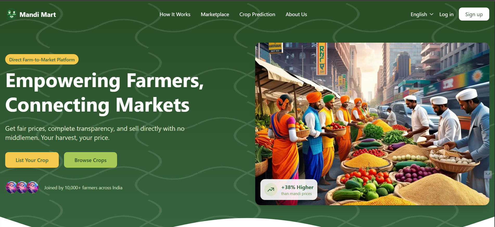

# Mandi Mart - Agricultural E-Commerce Platform

A modern agricultural marketplace connecting farmers directly with buyers, featuring real-time price analytics and AI-powered crop recommendations.



## Features

- 🌾 **Marketplace**: Direct farmer-to-buyer agricultural produce trading
- 📊 **Price Analytics**: Real-time market prices and trends
- 🤖 **AI Recommendations**: Smart crop suggestions based on location and conditions
- 🌍 **Multi-language**: Support for multiple Indian languages
- 📱 **Responsive Design**: Seamless experience across all devices
- 🔐 **Secure Authentication**: Role-based access for farmers and buyers

## Tech Stack

- **Frontend**: Next.js 15, TypeScript, Tailwind CSS
- **Backend**: Node.js, Express
- **Database**: MongoDB
- **Authentication**: JWT
- **APIs**: OpenCage Geocoding, Custom AI Model
- **Deployment**: Vercel

## Prerequisites

- Node.js 18+
- MongoDB
- npm or yarn

## Environment Variables

Create a `.env.local` file in the root directory:

```env
# Base URLs
NEXT_PUBLIC_APP_URL=http://localhost:3000
```

## Getting Started

1. Clone the repository:

```bash
git clone https://github.com/shivampatel0048/team-optimizer.git
cd farm-market
```

2. Install dependencies:

```bash
npm install
# or
yarn install
```

3. Set up environment variables:

```bash
cp .env.example .env.local
```

4. Run the development server:

```bash
npm run dev
# or
yarn dev
```

Open [http://localhost:3000](http://localhost:3000) to view the application.

## Project Structure

```
farm-market/
├── app/                    # Next.js 15 app directory
│   ├── (auth)/            # Authentication routes
│   ├── (dashboard)/       # Dashboard routes
│   └── (services)/        # Service routes
├── components/            # Reusable components
├── apis/                  # API integration
├── lib/                   # Utilities and configs
└── public/               # Static assets
```

## API Routes

- `/api/auth/*` - Authentication endpoints
- `/api/crops/*` - Crop and price related endpoints
- `/api/users/*` - User management endpoints

## Contributing

1. Fork the repository
2. Create your feature branch (`git checkout -b feature/amazing-feature`)
3. Commit your changes (`git commit -m 'Add some amazing feature'`)
4. Push to the branch (`git push origin feature/amazing-feature`)
5. Open a Pull Request

## License

This project is licensed under the MIT License - see the [LICENSE](LICENSE) file for details.

## Acknowledgments

- OpenCage for geocoding services
- MongoDB Atlas for database hosting
- Vercel for deployment